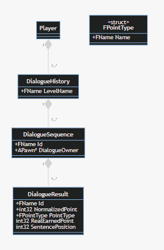

# Dialogue History

:information_source: Soon

## Key principles and concepts

### Conditions

To create a condition in any sentence def, we can use DialogueHistory like so:

-   if `None.LevelName.DialogueSequence#1.OwnerName.DialogueResult#2.RealEarnedPoint` > 0 && `LevelName.DialogueSequence#1.OwnerName.DialogueResult#2.PointType` == FPointType.CNV
-   if `None.None.None.None.DialogueResult#2.RealEarnedPoint` > 0 ==> means the dialogue block in the same dialogue sequence own by the same NPC in the same level in the same savegame.
-   if `None.None.None.AnotherOwner.DialogueResult#2.RealEarnedPoint` > 0 ==> means the dialogue block in the same dialogue sequence own by an another NPC in the same level.
-   if `None.None.None.*.DialogueResult#2.RealEarnedPoint` > 0 ==> means the total of RealEarned points from all same dialogue blocks in the same dialogue sequence own by any NPC in the same level.
-   if `None.*.None.NPCOwner.DialogueResult#2.RealEarnedPoint` > 0 ==> means in the same save game in every DialogueHistory (means in every level, at any session)

#### Structure

`Savegame.LevelName.DialogueSequenceName.OwnerName.DialogueResultName.PropertyName`

##### Possible values

| Savegame                                              | LevelName                                                                                | DialogueSequenceName                                                                       | OwnerName                                                                           | DialogueResultName                                      | PropertyName                                                                |
| ----------------------------------------------------- | ---------------------------------------------------------------------------------------- | ------------------------------------------------------------------------------------------ | ----------------------------------------------------------------------------------- | ------------------------------------------------------- | --------------------------------------------------------------------------- |
| - `None` for the current  - `*` for all save games | - `None` for the current - `*` for all Levels  - `AName` for a specific level name | - `None` for the current - `*` for all Levels - `AName` for a Dialogue sequence name | - `None` for the current NPC  - `*` for any NPC  - `AName` for a specific NPC | - `*` for all blocks  - `AName` for a specific block | `NormalizedPoint` `PointType` `RealEarnedPoint` `SentencePosition` |

##### Possible combinations

| Meaning                                                                                                                                                       | Savegame | LevelName | DialogueSequenceName | OwnerName | DialogueResultName | PropertyName     |
| :------------------------------------------------------------------------------------------------------------------------------------------------------------ | -------- | --------- | -------------------- | --------- | ------------------ | ---------------- |
| filter the sentence at position given by **SentencePosition** comparison in the block `AName` in the current **DialogueSequence**                             | None     | None      | None                 | None      | AName              | SentencePosition |
| get all points earned in the current **DialogueSequence**                                                                                                     | None     | None      | None                 | None      | \*                 | RealEarnedPoint  |
| get all points earned in the same **DialogueSequence** but own by NPC **Jack**                                                                                | None     | None      | None                 | Jack      | \*                 | RealEarnedPoint  |
| get points earned in the sequence **Sequence#2** with NPC **Marcel** during the same level session                                                            | None     | None      | Sequence#2           | Marcel    | \*                 | RealEarnedPoint  |
| filter the sentence position in the block **block#1** in the sequence **Sequence#2** with NPC **Marcel** during the same level session                        | None     | None      | Sequence#2           | Marcel    | block#1            | SentencePosition |
| get the sentence position in the block **block#1** in the sequence **Sequence#2** with NPC **Marcel** in any level (in case Marcel exists in different level) | None     | \*        | Sequence#2           | Marcel    | block#1            | SentencePosition |
| get the sentence position in the block **block#1** in the sequence **Sequence#2** with NPC **Marcel** in the current level but in any savegame                | \*       | None      | Sequence#2           | Marcel    | block#1            | NormalizedPoint  |

#### Tricky combinations

| Why                                                                                                                                                  | Savegame | LevelName | DialogueSequenceName | OwnerName | DialogueResultName | PropertyName     |
| :--------------------------------------------------------------------------------------------------------------------------------------------------- | -------- | --------- | -------------------- | --------- | ------------------ | ---------------- |
| Alone, this can't be usefull, it will compare every sentence position in any dialogue blocks... maybe to ckecks if player as a lack of creativity... | --       | --        | --                   | --        | \*                 | SentencePosition |
| can be usefull to ckecks if player respond everytime the same response, eg. checks his consitency...                                                 | --       | \*        | --                   | --        | AName              | SentencePosition |
| dito                                                                                                                                                 | \*       | --        | --                   | --        | AName              | SentencePosition |
