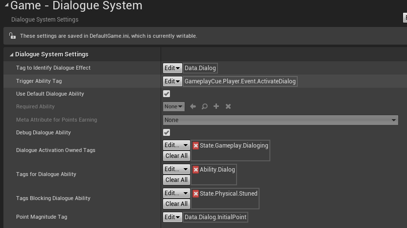
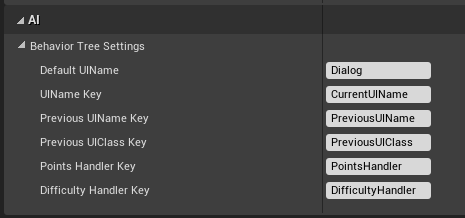
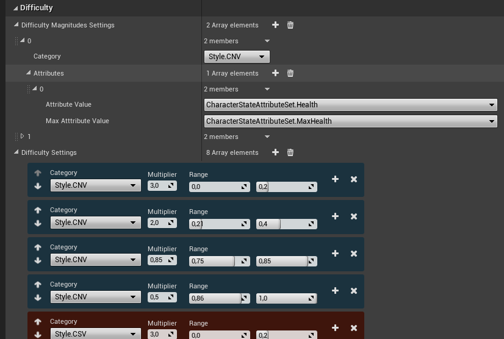
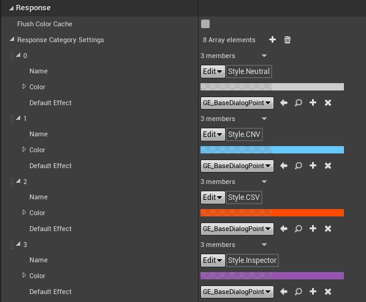

# Make It Works

:information_source: Soon

<!-- TOC -->

-   [1. Install GameplayAbilitySystem](#1-install-gameplayabilitysystem)
    -   [1.1. Create your set of Gameplay Tags](#11-create-your-set-of-gameplay-tags)
-   [2. Add required plugins as git submodules](#2-add-required-plugins-as-git-submodules)
-   [3. Configure the Dialogue System Plugin](#3-configure-the-dialogue-system-plugin)
    -   [3.1. Basics](#31-basics)
    -   [3.2. BB keys](#32-bb-keys)
    -   [3.3. Difficulty](#33-difficulty)
    -   [3.4. Responses](#34-responses)
-   [4. Create dialogue HUD](#4-create-dialogue-hud)
-   [5. Configure Character, AI NPC and GameMode](#5-configure-character-ai-npc-and-gamemode)
-   [6. Use native dialogue UIs](#6-use-native-dialogue-uis)
-   [7. Create your first dialogue](#7-create-your-first-dialogue)

<!-- /TOC -->

## 1. Install GameplayAbilitySystem

### 1.1. Create your set of Gameplay Tags

## 2. Add required plugins as git submodules

## 3. Configure the Dialogue System Plugin

### 3.1. Basics

### 3.2. BB keys

### 3.3. Difficulty

### 3.4. Responses

## 4. Create dialogue HUD

## 5. Configure Character, AI NPC and GameMode

## 6. Use native dialogue UIs

## 7. Create your first dialogue
