# UE4 Dialogue System (WIP)

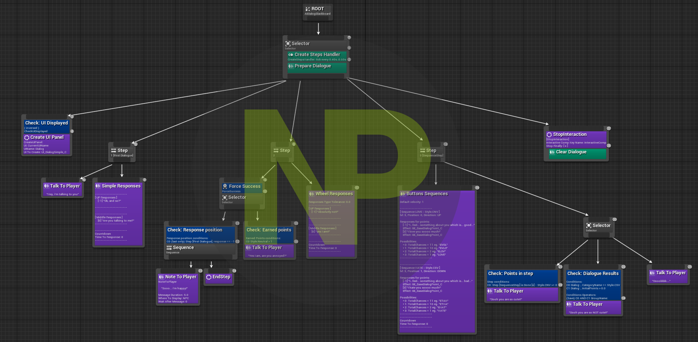

This plugin offers nodes to use in [Behavior Trees](https://docs.unrealengine.com/en-US/InteractiveExperiences/ArtificialIntelligence/BehaviorTrees/index.html). With them we don't need a new dedicated interface to use in Unreal Engine's Editor, you can add your dialogues next to other basics AI actions. Plus, it works with the [Gameplay Ability System](https://docs.unrealengine.com/en-US/InteractiveExperiences/GameplayAbilitySystem/index.html) and provides a basic [Dialogue ability](./Source/NansDialogueSystem/Public/Aiblity/GA_BaseDialogue.h) you can tweak.

> :warning: This is still a **Work In Progress** plugin. For now, docs and some very useful features missing to use it in a production games, like serialization of the Dialogues History (see below) to allow saving data across levels or make a savegame, but keep in touch!

|                                                                                                                                                                                                              |
| :---------------------------------------------------------------------------------------------------------------------------------------------------------------------------------------------------------------------------------------------------------------------------------------------------------------------------------------------------------------------------------------------: |
| I've decided to make all the code I developed for my games free to use and open source.  I am a true believer in the mindset that sharing and collaborating makes the world a better place.  The thing is: I'm fulltime dedicated to my project and these open source plugins, for coding I need a looooot of coffee, so please, help me to get my drug :stuck_out_tongue_closed_eyes: !! |

<!-- TOC -->

-   [1. Requirements](#1-requirements)
    -   [1.1. UE4 Plugins](#11-ue4-plugins)
-   [2. Features](#2-features)
    -   [2.1. Behavior Tree's nodes](#21-behavior-trees-nodes)
    -   [2.2. Components](#22-components)
        -   [2.2.1. AIDialogueComponent](#221-aidialoguecomponent)
        -   [2.2.2. PlayerDialogueComponent](#222-playerdialoguecomponent)
    -   [2.3. Dialogue History](#23-dialogue-history)
    -   [2.4. UI](#24-ui)
    -   [2.5. Dialogue Ability](#25-dialogue-ability)
-   [3. Plugin Parameters](#3-plugin-parameters)
-   [4. Contributing and Supporting](#4-contributing-and-supporting)

<!-- /TOC -->

## 1. Requirements

### 1.1. UE4 Plugins

-   [Gameplay Ability System](https://docs.unrealengine.com/en-US/InteractiveExperiences/GameplayAbilitySystem/index.html) (native UE4 plugins)
-   [NansUE4TestsHelpers](https://github.com/NansPellicari/UE4-TestsHelpers) (free UE4 plugins)
-   [NansCoreHelpers](https://github.com/NansPellicari/UE4-CoreHelpers) (free UE4 plugins)
-   [NansUE4Utilities](https://github.com/NansPellicari/UE4-Utilities) (free UE4 plugins)
-   [NansUMGExtent](https://github.com/NansPellicari/UE4-UMGExtent) (free UE4 plugins)
-   [NansBehaviorSteps](https://github.com/NansPellicari/UE4-BehaviorSteps) (free UE4 plugins)

## 2. Features

### 2.1. Behavior Tree's nodes

| Node                                                                          | Node Type | Usefull for/when                                                                                                                                                                                                                                                                                                                                                                                                                        |
| ----------------------------------------------------------------------------- | --------- | --------------------------------------------------------------------------------------------------------------------------------------------------------------------------------------------------------------------------------------------------------------------------------------------------------------------------------------------------------------------------------------------------------------------------------------- |
| 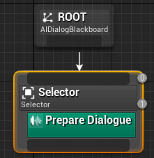                | Service   | :warning: Mandatory: It should be set directly on the first node after the Root node. It prepares 3 mains features: - Instantiate a service which communicates with [PlayerDialogueComponent](#dialogue-history) to manage dialogue points and instantiate Dialogue ability  - Instantiate a service which manages difficulty for each dialogue - Prepare [IDialogueHUD] to display Dialogue UI and save previous displayed UI |
| 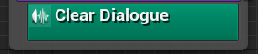                    | Service   | :warning: Mandatory: it should be used right before leaving the Behavior Tree. It removes dialogue UI and clear services. In case the BT aborts, the AIDialogueComponent do the same cleans.                                                                                                                                                                                                                                            |
| 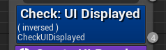               | Decorator | This just checks if the UI you asked is currently displayed.                                                                                                                                                                                                                                                                                                                                                                            |
| 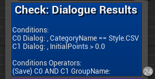   | Decorator | You should probably never use it, but it exposes the full search API. All other "Check" BT Decorators bellow are just most intuitive interfaces but use exactly the same API underneath.                                                                                                                                                                                                                                                |
| 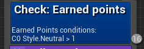         | Decorator | Will search and compare all points earned (unmitigated) by categories in the current Dialogue session.                                                                                                                                                                                                                                                                                                                                  |
|         | Decorator | Will search and compare points earned (unmitigated) in a specific step (Dialogue block).                                                                                                                                                                                                                                                                                                                                                |
| 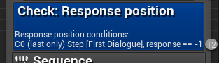 | Decorator | Will search and compare the response position which has been chosen in a specific step (Dialogue block)                                                                                                                                                                                                                                                                                                                                 |
| 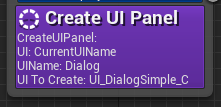                                 | Task      | Will call the [IDialogueHUD] method `DisplayUIPanel()`                                                                                                                                                                                                                                                                                                                                                                                  |
| 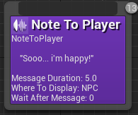                        | Task      | :warning: This task required to override AMessageableHUD (from the [NansUMGExtent](https://github.com/NansPellicari/UE4-UMGExtent) plugin) in your HUD class, see [HUD implementation example](./Docs/UIs/IDialogueHUD.md)                                                                                                                                                                                                              |
| 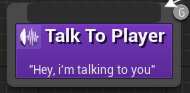                        | Task      | This will use a dedicated panel of the current dialogue UI to prompt a NPC message.                                                                                                                                                                                                                                                                                                                                                     |
| 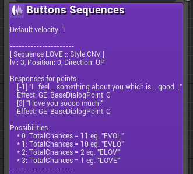                     | Task      | Offers you an interface to configure the **ButtonSequence** Dialogue's UI, more details in the [UIs sections][uis].                                                                                                                                                                                                                                                                                                                     |
| 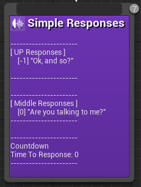                   | Task      | Offers you an interface to configure the **SimpleResponses** Dialogue's UI, more details in the [UIs sections][uis].                                                                                                                                                                                                                                                                                                                    |
| 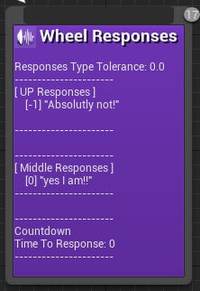                     | Task      | Offers you an interface to configure the **WheelResponses** Dialogue's UI, more details in the [UIs sections][uis].                                                                                                                                                                                                                                                                                                                     |

### 2.2. Components

#### 2.2.1. AIDialogueComponent

This is a really basics component for now (more will comes for it), its purpose is to clean up the Behavior Tree its NPC owns when a dialogue aborts.

> see [AIDialogueComponent.h](./Source/NansDialogueSystem/Public/Component/AIDialogueComponent.h)

#### 2.2.2. PlayerDialogueComponent

Its purpose is to save all the Dialogue results, communicate with the Dialogue Ability and make some searches in the last Dialogue results.

> see [PlayerDialogueComponent.h](./Source/NansDialogueSystem/Public/Component/PlayerDialogueComponent.h)

### 2.3. Dialogue History

:information_source: WIP

> [More detailed docs](./Docs/Core/DialogueHistory.md)

### 2.4. UI

:information_source: WIP

> [More detailed docs][uis]

### 2.5. Dialogue Ability

:information_source: Soon

## 3. Plugin Parameters

Take a look at the dedicated chapter in the [Make It Works](./Docs/MakeItWorks.md#3-configure-the-dialogue-system-plugin) page.

## Make it works

Look at the [Make It Works](./Docs/MakeItWorks.md) page

## 4. Contributing and Supporting

I've decided to make all the code I developed for my games free to use and open source.  
I am a true believer in the mindset that sharing and collaborating makes the world a better place.  
I'll be very glad if you decided to help me to follow my dream.

| How?                                                                                                                                                                               |                                                                                         With                                                                                         |
| :--------------------------------------------------------------------------------------------------------------------------------------------------------------------------------- | :----------------------------------------------------------------------------------------------------------------------------------------------------------------------------------: |
| **Donating**  Because I'm an independant developer/creator and for now I don't have  any income, I need money to support my daily needs (coffeeeeee).                        |  |
| **Contributing**  You are very welcome if you want to contribute. I explain [here](./CONTRIBUTING.md) in details what  is the most comfortable way to me you can contribute. |                                                                         [CONTRIBUTING.md](./CONTRIBUTING.md)                                                                         |

[idialoguehud]: Docs/UIs/IDialogueHUD.md
[uis]: ./Docs/UIs.md
